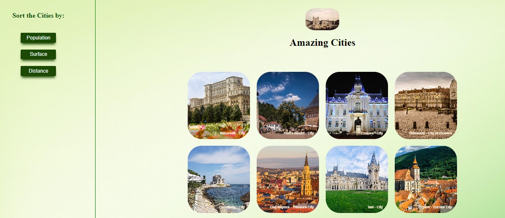

# Amazing Cities

Beautiful Cities from Romania

## Team

- [Mihai Iusztin](https://github.com/Mihai-Iusztin)

## Live

[Demo](https://mihai-iusztin.github.io/native-cities-react/)

## Amazing Cities : about some nice places

The goal is to apply and practice as many functionalities from React, using React Hooks (useState and useeffect) and fetch data from a local dummy server.

## Steps

- [x] Clone api
- [x] npm instal both the backend and api
- [x] start the backend - node app.js
- [x] start react - npm run dev
